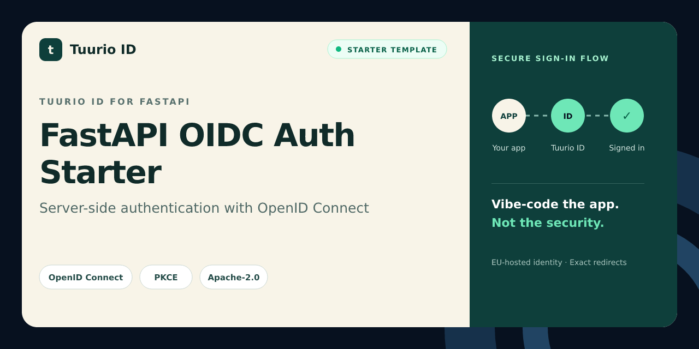

# FastAPI OIDC Auth Starter

FastAPI authentication starter for Tuurio ID with secure sessions and standards-based OpenID Connect.

[](https://github.com/Tuurio/fastapi-oidc-auth-starter/actions/workflows/verify.yml)



> Generated from [`Tuurio/auth_samples/auth_samples_fastapi`](https://github.com/Tuurio/auth_samples/tree/main/auth_samples_fastapi). Submit implementation fixes upstream so they are not replaced by the next synchronized release.

## What you get

- Standards-based OpenID Connect authentication with framework-native integration.
- Exact redirect and post-logout redirect handling.
- Protected-route and logout examples.
- A reviewed, pinned Tuurio provisioning workflow.

## Quickstart

1. Create a repository with **Use this template** or clone this repository.
2. Follow the framework-specific prerequisites below.
3. Review and run this pinned provisioning command:

```bash
npx manage-tuurio-id@1.1.6 init --framework fastapi --project-dir . --auth browser --yes --output json --campaign github_fastapi --no-open --no-wait
```

4. Approve the exact command, then complete the secure browser handoff yourself.
5. Run the build and verify one real sign-in and sign-out.

Never paste credentials, client secrets, authorization codes, tokens, session cookies, or environment-file contents into an agent chat. Browser and native applications are public clients and must not contain a client secret.

## Runtime and verification

- Runtime: Python 3.12+
- Package manager: pip
- Verification: `python3 -m pip install -r requirements.txt && python3 -m compileall -q app tests && python3 -m pytest -q`

## Security model

This starter uses OpenID Connect Authorization Code flow. Browser and native clients use PKCE S256 and contain no client secret. Redirect and post-logout redirect URIs must match exactly. Identity comes from the established OIDC integration or an authenticated UserInfo request; decoded JWT payloads are never treated as validation. Keep generated local environment files ignored and never commit tokens or credentials.

## Framework instructions

# FastAPI OIDC authentication with Tuurio ID

Async FastAPI starter using Authlib, Authorization Code + PKCE S256, framework-managed state/nonce and ID-token validation, an explicit UserInfo subject check, opaque server-side sessions, a protected route, and RP-initiated logout.

```bash
npx manage-tuurio-id@1.1.6 init --framework fastapi --project-dir . --auth browser --yes --output json --campaign github_fastapi --no-open --no-wait
python3 -m venv .venv && . .venv/bin/activate
pip install -r requirements.txt
uvicorn app.main:app --reload
```

Set a strong `TUURIO_SESSION_SECRET` and `TUURIO_COOKIE_SECURE=true` in production. Replace the in-memory opaque-session store with Redis or another shared server-side store before horizontal scaling. Tokens never enter the browser cookie.


## License

Licensed under the Apache License, Version 2.0. See [`LICENSE`](./LICENSE).
